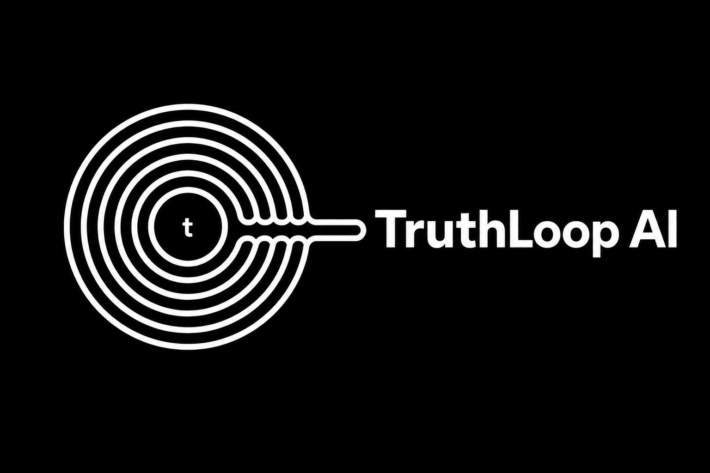

  

<h1 align="center">TruthLoop AI</h1>

<b>Find what you're avoiding.</b>

---

## What is TruthLoop AI?

TruthLoop AI is a behavioral clarity system designed to uncover the hidden emotional and psychological patterns that quietly influence decisions.

Most AI tools focus on providing answers.

TruthLoop AI focuses on revealing the pattern behind the question.

Because better advice rarely changes behavior.

Better awareness does.

---

## Why TruthLoop Exists

People often believe they have an information problem.

In reality, they may be repeating the same hidden behavioral loop.

TruthLoop AI helps identify those invisible loops before they become visible problems.

Instead of asking:

> "What should I do?"

TruthLoop AI asks:

> "What pattern keeps creating this outcome?"

---

## Core Philosophy

- Diagnosis before advice
- Awareness before action
- Patterns before solutions
- Clarity before confidence

---

## What TruthLoop AI Helps Discover

- Hidden Behavioral Patterns
- Emotional Drivers
- Decision Blind Spots
- Avoidance Loops
- Validation Patterns
- Founder Thinking Traps
- System Thinking
- Behavioral Psychology

---

## Current Focus

Building an AI system that helps founders, creators, professionals, and individuals recognize the hidden patterns shaping their choices.

The goal isn't to generate more information.

The goal is to generate deeper clarity.

---

## TruthLoop Framework

TruthLoop AI is built around a seven-loop behavioral discovery process.

Each loop moves from surface thinking toward deeper awareness, helping users identify the psychological patterns influencing their actions.

---

## Explore TruthLoop AI

🌐 https://truthloop.in/app

---

## Connect

**LinkedIn**

https://linkedin.com/in/arunbhatt2010

---

### TruthLoop AI

**Find what you're avoiding.**

